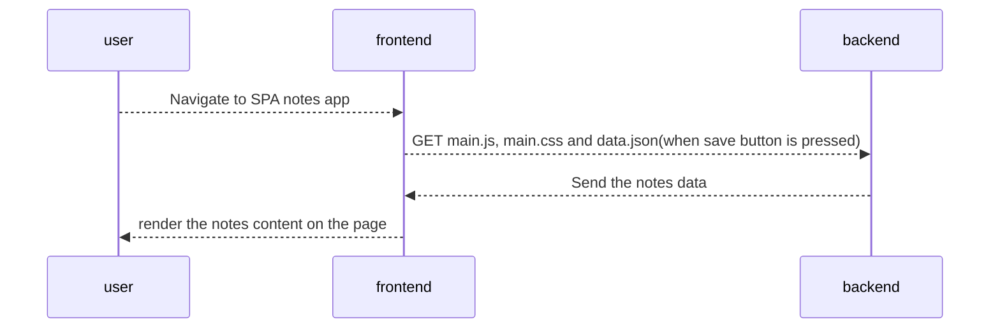

# This is Exercise 5 of part 0.

```mermaid
sequenceDiagram
  participant user
  participant frontend
  participant backend

  user -->> frontend: Navigate to SPA notes app
  frontend -->> backend: GET main.js, main.css and data.json(when save button is pressed) 
  backend -->> frontend: Send the notes data
  frontend -->> user: render the notes content on the page
```
