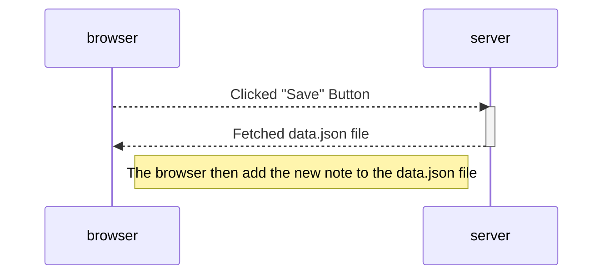

# This is Exercise 4 of part 0

```mermaid
sequenceDiagram
  participant browser
  participant server

  browser -->> server: Clicked "Save" Button
  activate server
  server -->> browser: Fetched data.json file
  deactivate server

  Note right of browser: The browser then add the new note to the data.json file
```
