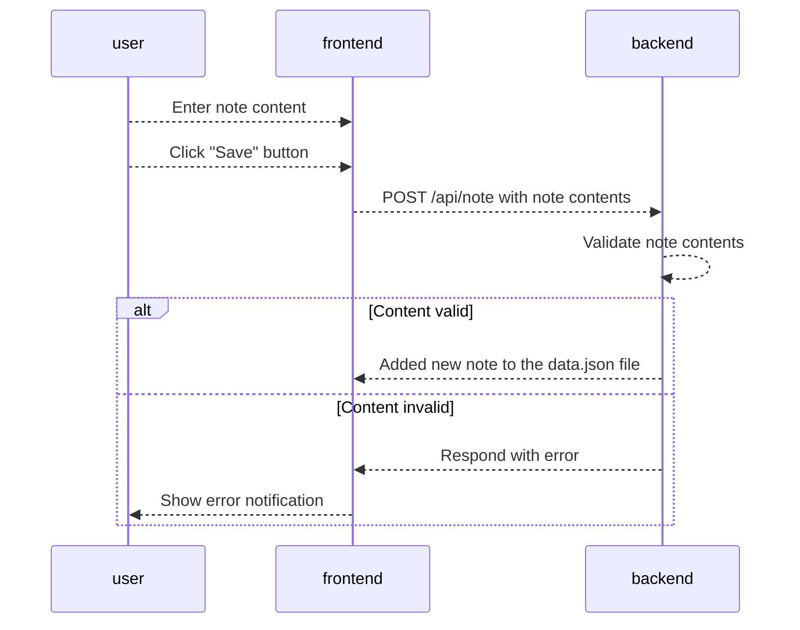

# This is Exercise 6 of part 0

```mermaid
sequenceDiagram
  participant user
  participant frontend
  participant backend

  user -->> frontend: Enter note content
  user -->> frontend: Click "Save" button
  frontend -->> backend: POST /api/note with note contents
  backend -->> backend: Validate note contents
  alt Content valid
        backend -->> frontend: Added new  note to the data.json file
    else Content invalid
        backend-->>frontend: Respond with error
        frontend-->>user: Show error notification
    end
```
